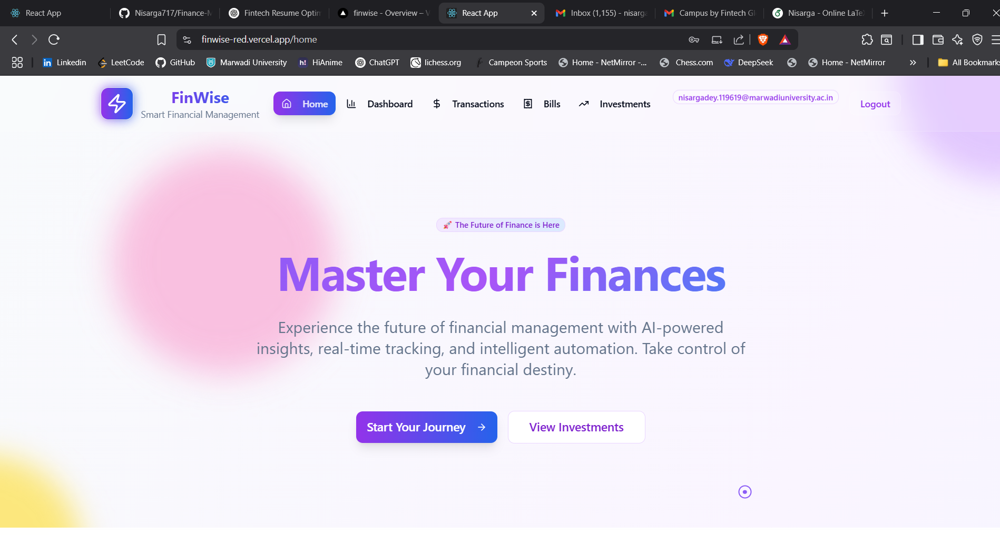
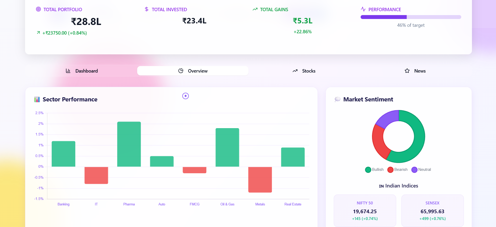

# 💰 FinWise - Smart Financial Management Platform

<div align="center">
  


**Empowering individuals to make smarter financial decisions through cutting-edge technology and AI-driven insights.**

[](https://reactjs.org/)
[](https://www.typescriptlang.org/)
[](https://tailwindcss.com/)
[](https://supabase.com/)

[✨ Live Demo](#) | [📖 Documentation](#) | [🚀 Getting Started](#getting-started) | [🤝 Contributing](#contributing)

</div>

---

## 🌟 Overview

FinWise is a comprehensive financial management platform designed to help users take control of their finances with style and intelligence. Built with modern web technologies and featuring a beautiful, responsive UI with custom animations and glass morphism effects.

### 🎯 Key Highlights

- **Smart Dashboard**: Real-time financial overview with interactive charts and analytics
- **Investment Tracking**: Portfolio management with live market data and stock analysis
- **Expense Management**: Intelligent transaction categorization and spending insights
- **Bill Management**: Never miss a payment with smart reminders and subscription tracking
- **Beautiful UI**: Custom glass morphism design with purple-blue gradient theme
- **Responsive Design**: Seamless experience across all devices
- **Real-time Data**: Live stock prices and market updates
- **Secure**: Bank-level security with end-to-end encryption

---

## 📸 Screenshots

### 🏠 Home Page
<!-- Add screenshot of home page -->
*Modern landing page with animated features and call-to-actions*



### 📊 Dashboard
<!-- Add screenshot of dashboard -->
*Comprehensive financial overview with key metrics and analytics*


### 💳 Transaction Management
<!-- Add screenshot of transaction page -->
*Smart expense tracking with category-wise analytics*


### 📈 Investment Portfolio
<!-- Add screenshot of investment page -->
*Real-time portfolio tracking with market insights*



### 🧾 Bills & Subscriptions
<!-- Add screenshot of bills page -->
*Never miss a payment with smart bill management*


---

## ✨ Features

### 🔐 Authentication & Security
- Secure user authentication with Supabase
- Protected routes and user session management
- Bank-level security standards

### 📊 Financial Dashboard
- Real-time financial health overview
- Interactive charts and visualizations
- Key performance indicators (KPIs)
- Monthly income vs expense tracking
- Savings rate calculation
- Recent activity timeline

### 💰 Transaction Management
- Add and categorize transactions
- Income and expense tracking
- Advanced analytics with charts
- Monthly spending patterns
- Category-wise breakdowns
- Search and filter capabilities

### 📈 Investment Portfolio
- Real-time stock market data
- Portfolio performance tracking
- Investment gains/losses calculation
- Stock watchlist management
- Market news integration
- Interactive stock charts
- Market overview with indices

### 🧾 Bills & Subscriptions
- Bill tracking and reminders
- Subscription management
- Recurring payment automation
- Due date notifications
- Payment history
- Category organization

### 🎨 UI/UX Features
- **Glass Morphism Design**: Modern glass-card effects
- **Custom Animations**: Smooth transitions and hover effects
- **Responsive Layout**: Mobile-first design approach
- **Dark/Light Themes**: Customizable color schemes
- **Custom Cursor Effects**: Interactive cursor animations
- **Loading States**: Beautiful loading animations
- **Gradient Themes**: Purple-blue gradient consistency

---

## 🛠️ Tech Stack

### Frontend
- **React 18.2.0** - Modern React with hooks and functional components
- **TypeScript** - Type-safe development
- **Tailwind CSS 3.4.0** - Utility-first CSS framework
- **shadcn/ui** - Beautiful and accessible component library
- **Lucide React** - Modern icon library
- **Recharts** - Responsive chart library
- **React Router DOM** - Client-side routing

### Backend & Database
- **Supabase** - Backend-as-a-Service
- **PostgreSQL** - Relational database
- **Row Level Security** - Database security

### External APIs
- **Finnhub API** - Real-time stock market data
- **Financial APIs** - Market news and data

### Development Tools
- **Vite** - Fast build tool
- **ESLint** - Code linting
- **Prettier** - Code formatting
- **Git** - Version control

---

## 🚀 Getting Started

### Prerequisites

Make sure you have the following installed:
- **Node.js** (v16 or higher)
- **npm** or **yarn**
- **Git**

### Installation

1. **Clone the repository**
   ```bash
   git clone https://github.com/yourusername/fin-wise.git
   cd fin-wise
   ```

2. **Install dependencies**
   ```bash
   cd frontend
   npm install
   ```

3. **Environment Setup**
   
   Create a `.env.local` file in the frontend directory:
   ```env
   REACT_APP_SUPABASE_URL=your_supabase_url
   REACT_APP_SUPABASE_ANON_KEY=your_supabase_anon_key
   REACT_APP_FINNHUB_API_KEY=your_finnhub_api_key
   ```

4. **Database Setup**
   
   Run the following SQL in your Supabase SQL editor:
   ```sql
   -- Users table (handled by Supabase Auth)
   
   -- Transactions table
   CREATE TABLE transactions (
     id UUID DEFAULT gen_random_uuid() PRIMARY KEY,
     user_id UUID REFERENCES auth.users(id) ON DELETE CASCADE,
     amount DECIMAL(10,2) NOT NULL,
     description TEXT,
     category VARCHAR(100),
     type VARCHAR(10) CHECK (type IN ('income', 'expense')),
     date TIMESTAMPTZ DEFAULT NOW(),
     created_at TIMESTAMPTZ DEFAULT NOW()
   );
   
   -- Bills table
   CREATE TABLE bills (
     id UUID DEFAULT gen_random_uuid() PRIMARY KEY,
     user_id UUID REFERENCES auth.users(id) ON DELETE CASCADE,
     title VARCHAR(255) NOT NULL,
     amount DECIMAL(10,2) NOT NULL,
     due_date DATE NOT NULL,
     category VARCHAR(100),
     status VARCHAR(20) DEFAULT 'pending',
     created_at TIMESTAMPTZ DEFAULT NOW()
   );
   
   -- Enable Row Level Security
   ALTER TABLE transactions ENABLE ROW LEVEL SECURITY;
   ALTER TABLE bills ENABLE ROW LEVEL SECURITY;
   
   -- RLS Policies
   CREATE POLICY "Users can only see their own transactions" ON transactions
     FOR ALL USING (auth.uid() = user_id);
   
   CREATE POLICY "Users can only see their own bills" ON bills
     FOR ALL USING (auth.uid() = user_id);
   ```

5. **Start the development server**
   ```bash
   npm start
   ```

6. **Open your browser**
   
   Navigate to `http://localhost:3000`

---

## 📁 Project Structure

```
fin-wise/
├── frontend/
│   ├── public/
│   │   ├── favicon.ico
│   │   ├── logo192.png
│   │   └── manifest.json
│   ├── src/
│   │   ├── components/
│   │   │   ├── ui/           # shadcn/ui components
│   │   │   ├── Layout.tsx    # Main layout with header/footer
│   │   │   ├── StockChart.tsx
│   │   │   ├── MarketOverview.tsx
│   │   │   └── ...
│   │   ├── pages/
│   │   │   ├── home.tsx
│   │   │   ├── dashboard.tsx
│   │   │   ├── transaction.tsx
│   │   │   ├── investment.tsx
│   │   │   └── bills.tsx
│   │   ├── context/
│   │   │   └── authContext.tsx
│   │   ├── lib/
│   │   │   ├── supabaseClient.ts
│   │   │   ├── finnhubConfig.ts
│   │   │   └── utils.ts
│   │   ├── types/
│   │   │   └── database.ts
│   │   ├── styles/
│   │   ├── App.tsx
│   │   └── index.tsx
│   ├── package.json
│   ├── tailwind.config.js
│   └── tsconfig.json
├── screenshots/
├── README.md
└── .gitignore
```

---

## 🎨 Design System

### Color Palette
- **Primary**: Purple (#8b5cf6) to Blue (#3b82f6) gradients
- **Success**: Green (#10b981)
- **Error**: Red (#ef4444)
- **Warning**: Orange (#f59e0b)
- **Neutral**: Gray scale (#64748b, #94a3b8, #cbd5e1)

### Typography
- **Font Family**: Inter, Segoe UI, Roboto
- **Headings**: Bold gradient text effects
- **Body**: Clean, readable typography

### Components
- **Glass Cards**: Backdrop blur with subtle borders
- **Animated Buttons**: Hover effects and ripple animations
- **Custom Cursor**: Interactive cursor effects
- **Loading States**: Smooth loading animations

---

## 📊 Features Deep Dive

### Dashboard Analytics
- Monthly income vs expenses comparison
- Category-wise spending breakdown
- Financial health indicators
- Recent transaction timeline
- Upcoming bills and reminders

### Investment Tracking
- Real-time portfolio valuation
- Individual stock performance
- Market indices tracking (NIFTY, SENSEX)
- Sector-wise analysis
- Investment gains/losses calculation

### Smart Categorization
- Automatic transaction categorization
- Custom category creation
- Visual spending analytics
- Budget tracking and alerts

---

## 🤝 Contributing

We welcome contributions! Please follow these steps:

1. **Fork the repository**
2. **Create a feature branch**
   ```bash
   git checkout -b feature/amazing-feature
   ```
3. **Commit your changes**
   ```bash
   git commit -m 'Add some amazing feature'
   ```
4. **Push to the branch**
   ```bash
   git push origin feature/amazing-feature
   ```
5. **Open a Pull Request**

### Development Guidelines
- Follow TypeScript best practices
- Use meaningful commit messages
- Add tests for new features
- Update documentation as needed
- Follow the existing code style

---

## 🔮 Roadmap

- [ ] **AI-Powered Insights** - Machine learning for spending patterns
- [ ] **Mobile App** - React Native mobile application
- [ ] **Crypto Portfolio** - Cryptocurrency tracking and management
- [ ] **Goal Setting** - Financial goal tracking and recommendations
- [ ] **Bank Integration** - Direct bank account connection
- [ ] **Advanced Analytics** - Predictive analytics and forecasting
- [ ] **Multi-Currency** - Support for multiple currencies
- [ ] **API Access** - Public API for third-party integrations

---

## 📄 License

This project is licensed under the MIT License - see the [LICENSE](LICENSE) file for details.

---

## 🙏 Acknowledgments

- **shadcn/ui** for the beautiful component library
- **Supabase** for the amazing backend platform
- **Finnhub** for real-time market data
- **Tailwind CSS** for the utility-first CSS framework
- **Lucide** for the clean and modern icons

---

## 📞 Support

If you have any questions or need help, please:

- 📧 Email: [your-email@example.com](mailto:nisargadey583@gmail.com)
- 🐛 Issues: [GitHub Issues](https://github.com/yourusername/fin-wise/issues)
- 💬 Discussions: [GitHub Discussions](https://github.com/yourusername/fin-wise/discussions)

---

<div align="center">

**Made with ❤️ by [Your Name](https://github.com/yourusername)**

⭐ Star this repository if you found it helpful!

</div> 
